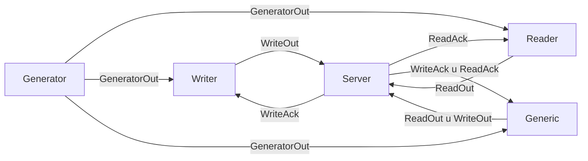

```rs
#[derive(Encode, Decode, Debug, Clone, DefaultPrio, DeriveMsg)]
pub struct WriteOut;

// From ReaderClient to Server
#[derive(Encode, Decode, Debug, Clone, DefaultPrio, DeriveMsg)]
pub struct ReadOut;

// Generic client produces both reads and writes
#[Union(GenericOut, ReadOut, WriteOut)]

// Server consumes reads and writes
#[Union(ServerIn, ReadOut, WriteOut)]

pub struct ReadAck;
pub struct WriteAck;

// From Server to Clients
#[Union(ServerOut, ReadAck, WriteAck)]

pub struct GeneratorOut;
// Clients can receive message from server as well as generator
#[Union(ReadIn, ReadAck, GeneratorOut)]
#[Union(WriteIn, WriteAck, GeneratorOut)]
#[Union(GenericIn, ServerOut, GeneratorOut)]
```

